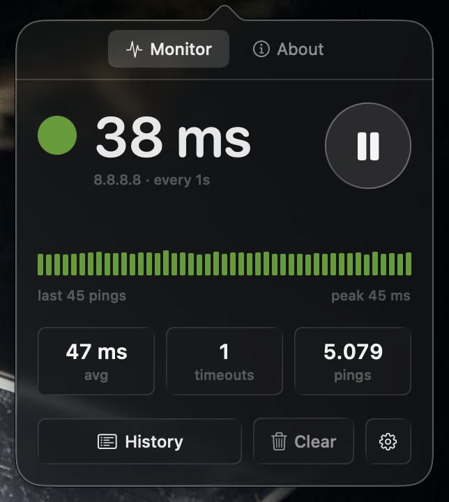
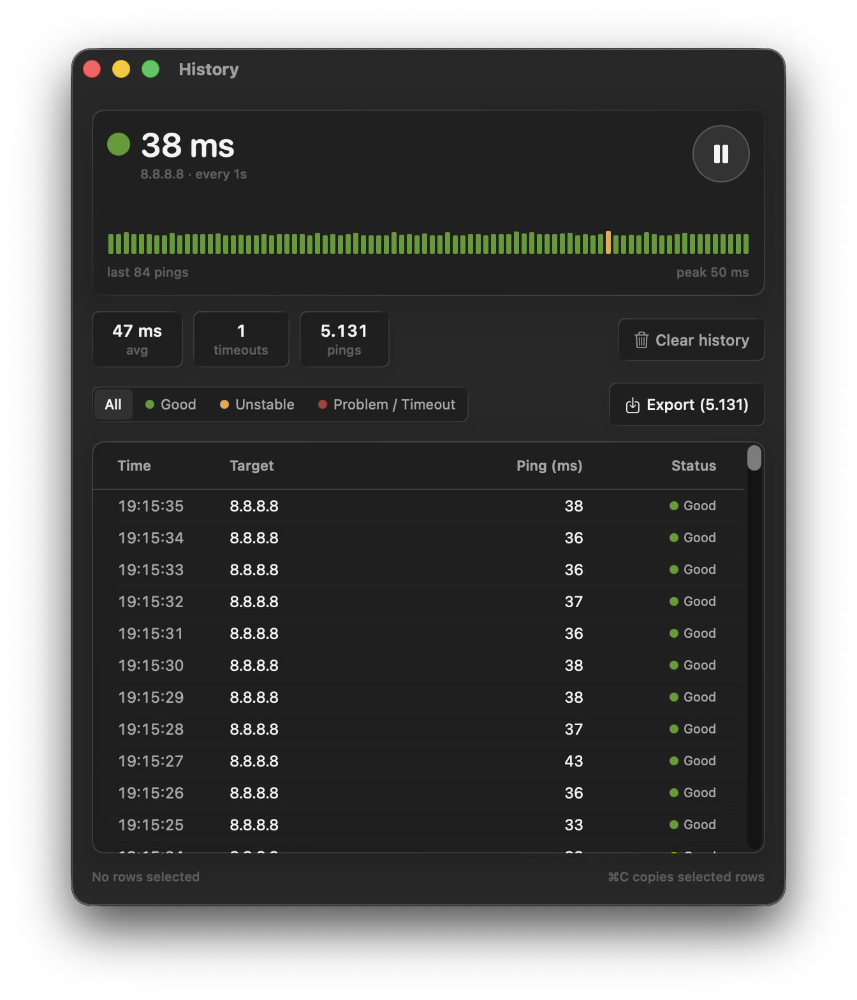
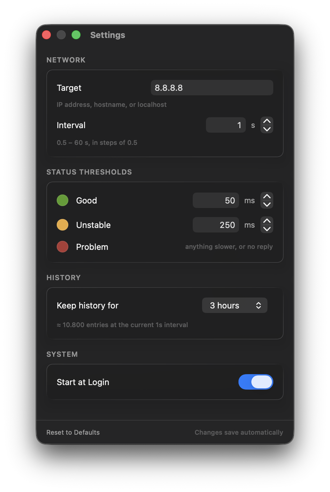

# PingMate

**Know instantly whether your internet is the problem.**

[](https://github.com/kikudjira/pingmate/releases/latest)
[](https://github.com/kikudjira/pingmate/releases)
[](LICENSE)


<br clear="left" />

<p align="center">
  
</p>

The call freezes, someone says *"you're breaking up"*, and nobody knows whose fault it is. PingMate has been watching the whole time: it pings a host every second and colours a dot in your menu bar. Glance up, and you know.

A native macOS menu bar app, written in Swift and SwiftUI.

## Features

- 🟢 **A dot that changes colour** — green, yellow, red. That's the whole interface, most days.
- 💍 **Recovery rings** — a green dot with a red ring means it just came back. Blinks you missed still leave a trace.
- 📈 **Latency sparkline** in the popover and the history window.
- 📜 **History** with status filters, ⌘C on selected rows, and CSV export.
- 🎨 **Your thresholds, your colours.**
- 🚀 **Launch at login**, one checkbox.

## Install

```sh
brew tap kikudjira/pingmate https://github.com/kikudjira/pingmate
brew install --cask pingmate
```

Or grab the DMG from the [latest release](https://github.com/kikudjira/pingmate/releases/latest) and drag PingMate to Applications — then read the next bit, because macOS is about to be dramatic.

## "PingMate can't be opened because Apple cannot check it"

It's fine — it's unsigned. One command fixes it for good:

```sh
xattr -dr com.apple.quarantine /Applications/PingMate.app
```

Or open **System Settings → Privacy & Security** and hit **Open Anyway**. The Homebrew cask does this for you.

## Using it

**Left-click** the dot: latency, sparkline, stats, and buttons for History, Clear and Settings.
**Right-click**: Open History (⌘M), Settings (⌘,), Start/Stop Monitoring, Quit (⌘Q).

| Dot | Meaning | Default |
|-----|---------|---------|
| 🟢 Green | Good | reply in ≤ 50 ms |
| 🟡 Yellow | Unstable | reply in ≤ 250 ms |
| 🔴 Red | Problem | slower than that, or no reply |
| ⚪️ White | Paused | not monitoring |

<p align="center">
  
</p>

### Settings

<p align="center">
  
</p>

| Setting | Default | Range |
|---------|---------|-------|
| Target | `8.8.8.8` | IPv4, hostname, or `localhost` |
| Interval | 1 s | 0.5–60 s |
| Good threshold | 50 ms | 1–1000 ms |
| Unstable threshold | 250 ms | 1–5000 ms, above the good one |
| History retention | 3 hours | 1 / 3 / 12 / 24 hours |
| Colours | 🟢 `#559C24` 🟡 `#EAA93B` 🔴 `#AE3B36` | anything you like |

## Build from source

```sh
git clone https://github.com/kikudjira/pingmate.git
cd pingmate
./scripts/build-app.sh 1.0.0
open build/Build/Products/Release/PingMate.app
```

Or open `PingMate/PingMate.xcodeproj` and press ⌘R. Needs **macOS 26** and **Xcode 26** — the interface is built on Liquid Glass.

`./scripts/make-dmg.sh 1.0.0` packages it into `dist/`.

## License

[MIT](LICENSE) — Andrey Sekirkin.
